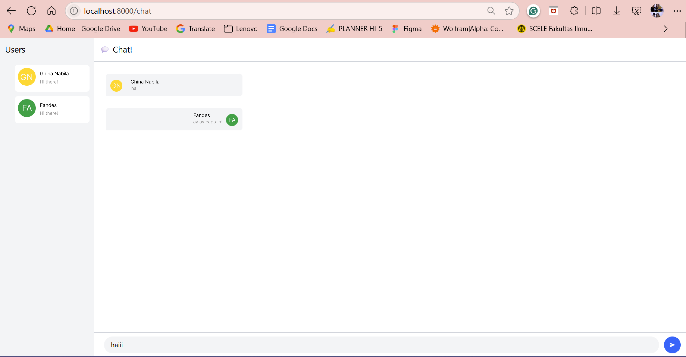

**Nama : Ghina Nabila Gunawan**

**Kelas : AdvProg - A**

**Asdos : HAN**

## Tutorial Module 10 - YewChat

### Experiment 3.1: Original code - WebChat using Yew

Aplikasi WebChat ini menyediakan interface berbasis web dengan dua panel utama:
Panel sebelah kiri menampilkan daftar pengguna yang sedang online.
Panel sebelah kanan adalah area chat untuk bertukar pesan secara real-time.

Pesan dan status pengguna langsung diperbarui tanpa perlu refresh halaman.
Pengguna dapat mengetik pesan pada kotak input di bawah dan mengirimnya dengan tombol kirim.

### Experiment 3.2: Be Creative!

Saya menambahkan sentuhan visual baru supaya tampilan chat lebih hidup. Tujuan utamanya adalah membuat interface yang lebih enak dilihat dan mudah dikenali oleh pengguna.

* Avatar pengguna ditampilkan berdasarkan inisial nama, dengan latar warna yang berbeda:
* Pesan pengguna ditampilkan dalam bubble chat yang rapi dan terpisah jelas berdasarkan pengirim.
